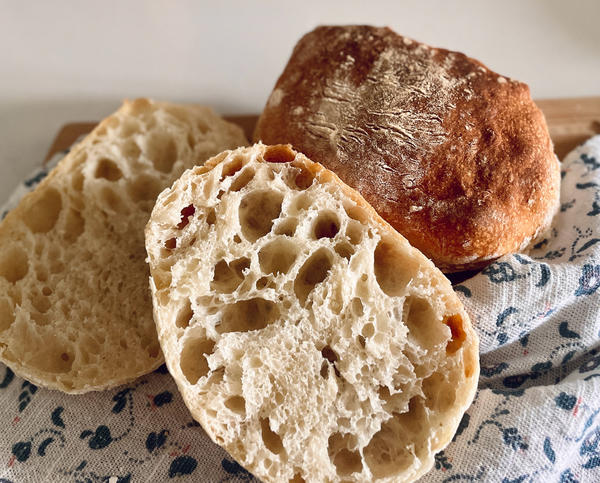

## 用料
T65 500克（或者高筋粉）
低糖酵母 2克
盐 9克
橄榄油 25克
鲁邦种 200克
冰水 350克
## 步骤
步骤1：
把面粉、盐和80%的冰水与橄榄油倒入厨师机，先慢速，再快速搅拌成团

步骤2：
搅拌到面团光滑，不需要出薄膜

步骤3：
这时候面团出缸把酵母加进去，免得忘记，面团包上保鲜膜冷藏一个小时进行水解

步骤4：
一小时后，把面团，鲁邦种倒入搅拌缸

步骤5:
鲁邦种和面团搅拌混合好后分次加入剩余水和橄榄油，慢速搅拌，混合均匀再开快速

步骤6:
快速搅拌至能出很薄的膜

步骤7:
面团搅拌好后，在表面撒一层手粉，方便出缸，在烤盘里倒入橄榄油，抹匀，方便翻面

步骤8:
面团倒入烤盘，盖上保鲜膜，进行基础醒发，30分钟

步骤9:
半小时后，进行第一次折叠

步骤10:
四边往中间折叠、翻面

步骤11:
翻好面之后再次进行醒发半个小时，半个小时之后，第二次再次进行翻面折叠

步骤12:
折叠之后进行最后半小时的醒发，醒发好后表面撒粉，用手搓出纹路

 步骤13:
桌面撒粉，面团扣过来进行整形分割 

步骤14:
表面撒粉，分割成6等份 

步骤15:
醒发布上撒粉，把恰巴塔放在醒发布上，有纹路的一面朝下 

步骤16:
进行最后一次醒发 

步骤17:
盖上另一半醒发布，醒发40分钟 

步骤18:
醒发好的面团 

步骤19:
用转移板，转移到烤盘上，有纹路的一面朝上 

步骤20:
烤箱预热，上下火230，25分钟，放在底部，喷蒸汽

 步骤21:
烤好的恰巴塔，一起动手吧！

## 成果展示

## 视频教程
<iframe src="//player.bilibili.com/player.html?isOutside=true&aid=250930116&bvid=BV1jv411g7uB&cid=421333318&p=1" scrolling="no" border="0" frameborder="no" framespacing="0" allowfullscreen="true" width="800px" height="600px"></iframe>
