## 用料  
高筋面粉	250g

水	140g—150g

即发酵母	3g

糖	8g

盐	4g

黄油（可不加）	5g

煮面糖水	

白（红）糖	50g

水	1000g
## 制作步骤
第一步：除开黄油，把所有材料和在一起，形成面团后，开始揉，揉到扩展阶段，注意是扩展阶段！扩展阶段！扩展阶段！

扩展阶段：面团能撑开不破，微微厚，戳破后，破口处周围呈小锯齿状。
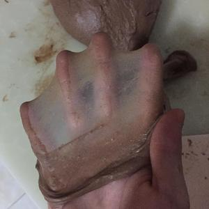

上图所示的是完全阶段，大家注意到没有，能出这种膜的面团含水量都超级大，再看看你手上的面团，根本不黏手对不对，因为水量只占了50%左右，如果你能揉出照片上的膜，请收下我的膝盖。虽然不用揉出上述那样，但是也要揉到稍微厚一些的膜的程度，当然膜越薄越好，在将面团团圆的时候，如果没有揉出膜，表面是凹凸不平的，这样也很难在后面使贝果面团表面光滑，不仅会使成品皱巴巴，也会影响发酵，所以虽然不用揉到完全阶段，但也尽力往那靠拢吧，至少要使面团表面光滑。

揉面教程推荐帅帅小厨的微博置顶（微博名字就是帅帅小厨）他的方法揉出面筋超快！

黄油可以在摔打面团的时候通过抹在裂口出的方式加入，只有5g很快就会加完，加完后摔个20次也就差不多达到揉面要求了。

第二步：揉好面团后，将面团均匀分割成五份，每份约80g左右，团成面团，要使表面光滑。左手拖着面团，右手半握面团旋转面团同时用轻力将表面向下抹，使表面紧绷变得光滑，如果之前没有膜的话，这一步要达到目的就很困难了，抹的时候很容易抹破。当然，其他的团圆方法都可以，只要表面绷紧没有裂口。

静置时盖保鲜膜，不要放湿布，贝果不能拥有那么多水，松弛15分钟左右。 
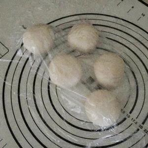

第三步：贝果整形，和其他方子提到的相同，也是特别推荐帅帅小厨微博置顶中的贝果整形视频，很详细，这里我提几个注意事项。

1.擀面的时候不要太粗暴，光滑的一面在折叠前要放在下面，这样整形好的贝果表皮才不会裂开。

2.折叠的时候，不要手软，使劲拍打，将折叠时裹进去的气体排出去。接口处要捏紧，所谓的捏紧，是指，用两根手指，大拇指和食指，将裂口处的缝一点一点捏合紧冒出点点面团都无所谓一定要使接口缝在不仔细找的情况下看不出来。

3.80g的面团要达到至少23厘米长成品才会有洞洞，而且该面团容易收缩，所以搓条的时候尽量达到25厘米。

4.头尾收口处也要像第2提示中一样！捏紧，不然会出现上图情况（一定要看帅帅小厨的贝果整形视频）  
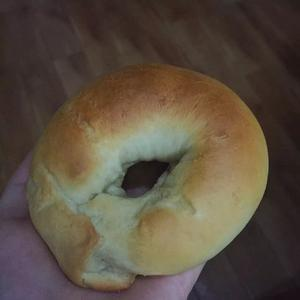

第四步：面团赶长，成长条橄榄形，两边朝中间折，压紧排气。  
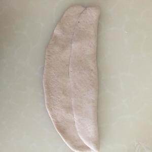

第五步：对折面团捏紧收口，这样捏！！！   
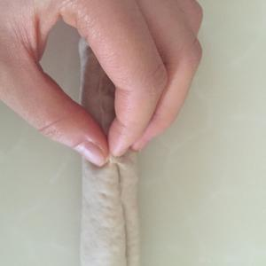

第六步：搓长，圈圈要大的话26-28cm的长度  
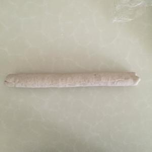

第七步：一头压扁，擀面杖擀暴  
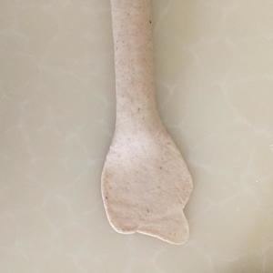

第八步：将另外一头放在擀薄的地方，头部要在上面一点，这样才会显得均匀一些。注意！此时之前的收口要朝上！   
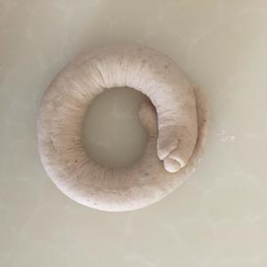

第九步：像这样捏紧收口，所有收口都是朝同一面，向下放在油纸上  
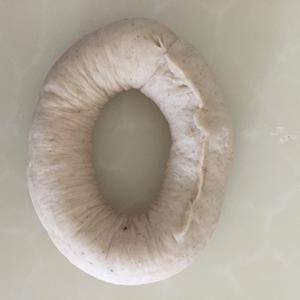

第十步：整形好后，请剪出5块比贝果面团直径大的油纸，将贝果放在上面，再放在烤盘上，送进烤箱进行发酵30分钟。
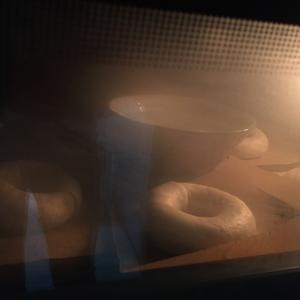

发酵时不要盖湿布，盖了湿布后贝果面团表皮会变湿，在煮面团时会立马收缩。如果想要保持发酵箱湿度，在里面放一碗开水，烤箱的发酵功能根据个人烤箱自己设置，温度在30°到35°之间，不可过高。发酵只进行25分钟

第十一步：在面团发酵时，准备糖水，1000克水50克糖，白砂糖 红糖都行，红糖最后上色会浓点。大火烧水，看到水底有小气泡产生的时候，立马转小火，只要灶台最小最小的火力，维持这半开的水温。不要烧开！！！（水温最好80-90度，也就是说不是煮面团，而是烫面团）
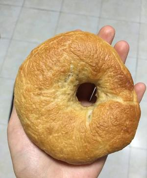

将发酵好的面团取出，放进糖水，因为贝果底部比较粘，如果直接生拉硬拽下来，变形严重而且绝对塌，到时候你就吃的像图中的饼了，这也就是为啥之前要剪油纸的原因，你可以手托油纸，将油纸和面团一起放进糖水锅，这时油纸自然会掉落，捞起来就好了。面团根据火候每面煮20到30秒，如果温度不可过高，如果想皮厚一些，降低点温度，增加煮面时间（可达每面50s）。再捞起控干。控干不是等面团干，而是沥去多余水分。

（在煮的时候微微皱皮是可以的，后面烤的时候面团会发胀把表面撑起来的，但是褶皱越少越好）

取出面团时就开始预热烤箱。  

第十二步：烤箱预热到200度，放中层烤15分钟，中途观测面团上色情况，加盖锡纸，不要烤焦了。如果想表皮脆一些，降低温度，增加烘烤时间，这样完美的贝果就出来啦！补充一句，请大家仔细看图，如果大家用的不是不沾烤盘，需要垫油纸！！！如果是不沾烤盘随你垫不垫，我以为这是常识（；￣д￣）
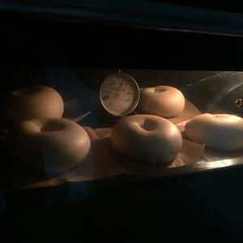

如果想要脆皮，在预热烤箱的时候底层放一烤盘，面包放进去前，在底部烤盘倒开水制造蒸汽，再放进面包，注意安全。   

### 贝果皱皮的原因：

1.发酵结束后，面团表皮不够干，不能保持紧绷状态，在遇到热水后会立马吸水产生褶皱。这也为什么贝果面团含水量少的原因。最好的状态是发酵结束后，摸着面团表面略干，轻轻提起不会变形。因此在下锅前面团都不能用湿帕遮盖，需要保持表皮的光滑。但是不要太过啊！摸着不粘手就行了，发酵的时候还是要一点湿度的。

2.糖水温度太高，煮面时间太长。这两个相互替换，如果水温高减少煮面时间，反之增加时间。试过两次后，感觉糖水在半开时的温度最合适。这样煮好后的面团也是表面光滑的。糖水温度宁愿低一些也不要过高！！！

3.发酵过度，一定注意不要超过30分钟，温度和湿度高些情况下20分钟也可以！   

## 小贴士
注意，水预留10克，少了加，多了不加。水不小心加多一点点（10克内）都是没问题的，只是需要将发酵的湿度降低，发酵时间减少，煮面水的温度低一些。面包出炉后晾凉的过程中会因为水分多四周而变皱一些，不过这样的贝果会更软一些。上面表面刚烤出来是不皱的噢！
说味道咸的！标准是5克盐，如果加够了糖，是不会咸的，没加糖的自行减盐。
## 视频教程
<iframe src="//player.bilibili.com/player.html?isOutside=true&aid=525104792&bvid=BV1cM411j7rL&cid=1027756385&p=1" scrolling="no" border="0" frameborder="no" framespacing="0" allowfullscreen="true" height="600px" width="800px"></iframe>