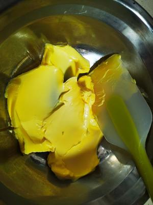
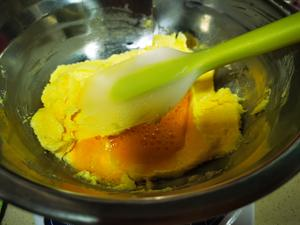
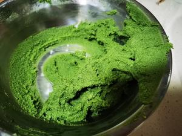
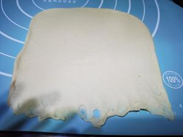
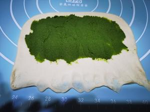
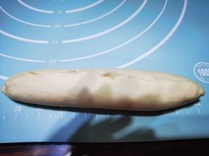
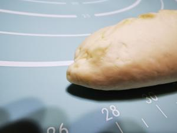
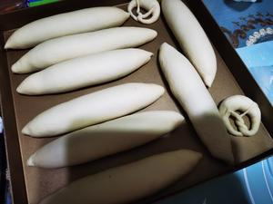
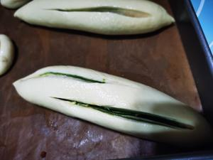
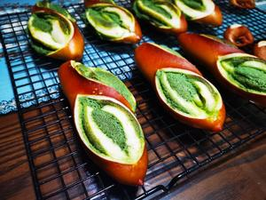

|用料                     | 克重          | 
| ------| ---------|
|高筋面粉	| 500  | 
| 低粉 | 33   | 
| 低糖干酵母            | 4 | 
| 海盐                   | 5  | 
| 奶粉            | 17 | 
| 水 | 315   | 
| 黄油 | 15   |
| 抹茶粉 | 5   |
| 细砂糖 | 30   |
| 全蛋液 | 20   |
| 奶粉 | 60   |
| 黄油 | 70   |

## 制作步骤
先做抹茶奶酥馅

1.黄油室温软化 

2.加入细砂糖搅拌均匀  

3.加入20克全蛋液，搅打均匀  

4.加入奶粉 

5.加入抹茶粉，不要吝惜抹茶粉，这是灵魂 

加完抹茶粉后整体馅料的样子

6.揉面，除了黄油全部放入面包机，10分钟后放入黄油，一共揉面30分(25分钟也可以) 

分成大概100克一个的小面团，醒发15分钟 

7.用擀面杖擀成长方形，然后翻面 

8.压薄底边 

9.抹上抹茶奶酥馅

边边要留一点，不要都抹上，便于收口 

10.开始卷，卷紧

11.捏紧收口  

12.捏紧两端 

13.搓成橄榄状，冰箱冷冻30-40分钟 

14.准备碱水，20克碱+500克水 冷冻好的面团，浸泡50秒左右 

15.在晾网上沥干水分

16.用刀片划口  

17.摆入烤盘
205℃，17分钟，中层，最后五分钟记得盖锡纸，以免抹茶馅烤变色  

## 视频教程
<iframe src="//player.bilibili.com/player.html?isOutside=true&aid=997791060&bvid=BV1ks4y1r7X8&cid=1178159558&p=1" scrolling="no" border="0" frameborder="no" framespacing="0" allowfullscreen="true" height="600px" width="800px"></iframe>