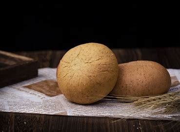

## 用料
T65面粉	250克

鲁邦种	50克

盐	5克

水	175克

## 制作步骤

⭕️面粉的选择

市面上制作欧包的面粉分为几大类（按照筋度由弱到强排序）：

1⃣法国面粉：各大品牌T65/55等（灰份高、筋度较弱、断口性好、麦香浓郁、回甘较好）

2⃣国产高筋粉：腰站子有机小麦粉/丝麦耘雪花粉等（操作性比法国面粉略好，回甘明显、麦香次之、上色金黄，组织轻盈、略有一点Q弹、皮薄脆）

3⃣日系法粉（中筋粉）：鸟越铁塔、CDC、百合花、拿破仑等（较易操作、筋度适中、回甘和麦香不是特别明显）

4⃣日系高粉/美系中、高筋粉：BOB、金牌、凯瑟琳等（筋度强、好操作、不容易发过、麦香和回甘较差、口感韧劲太足，断口性较差，建议搭配全麦粉或多谷物平衡筋度和麦香）

由于面粉筋度不同，操作的难易程度和面团耐发程度也不同。面筋越强，操作性和耐发性越好。所以在初学的时期可以选择筋度好一点的面粉来练习。也可以搭配不同的面粉，比如用T65搭配10-30%的日式高筋粉来提升筋度。 面筋筋度越好，组织也越容易出大气孔。

⭕️含水量的确定

虽然气孔的大小和含水量在一定程度上成正比，但是含水量过高比较容易造成面筋疲软、充气困难和不耐发的情况；而水量太少面筋太紧也会造成充气阻力太大。因此合适的含水量对于欧包的制作至关重要。下面列出不同面粉的参考含水量。

1⃣法国面粉（T65）：70-75%，水解的话建议先加70%，剩下的5%以后加水的方式加入。

2⃣国产高筋粉：70-75%

3⃣日系法粉：72-75%

4⃣日系/美系高筋粉：78-85%

以上仅做参考，初次使用先按照最低水量操作，如果觉得面团还可以加水，可以通过后加水（面团打到扩展阶段，分次少量添加进去面团）的方式添加。

另外，同一种面粉由于批次不同和储存环境湿度不同，都会造成吸水性有差异。因此大家需要酌情去调整水量以达到最佳状态。比如最近的T65面粉由于批次和天气湿度的影响吸水性只有65%左右。

最后，如果面团里添加全麦粉或黑裸麦粉这些灰份比较高的面粉，水量也要适当增加一些。

所以，在做任何一个配方的时候需要看清楚是否使用的是和配方相同的面粉。否则，就需要根据自己的面粉吸水性来确定水量。不要盲目跟随。 

⭕️拉伸折叠的方法

大家都知道欧包的制作过程中，拉伸折叠是一个非常重要的环节，无论是厨师机打面或是免揉法，都需要在基础发酵的过程中通过拉伸折叠来增强面筋。新手在学习欧包的道路上一定要注意拉伸折叠的手法会因为使用面粉种类的不同而大相径庭。

⚠️如果你在外网学习，那么需要知道大部分博主使用的是美式高筋或中筋粉，比较多的是鲍勃（bob）、金牌（GOLD）、KA等。这类粉的筋度比较强，吸水性也比较好。因此操作过程的折叠拉伸强度特别大，很多博主都会使用lamination(做卷子也叫大折叠)的方式去增强面筋。

❌BUT如果你使用的是法国面粉或国产高筋/中筋粉（软粉），那么这种做卷子的操作手法就不太可取了。因为这类粉弹性比较弱，这么高强度的将面团拉伸到薄薄的一大片，很容易把面筋的弹力拉松掉，造成拓展过度（好像牛皮筋拉伸到极限没了弹力一样）。之后面团反而会很难充气，因为弹性丧失以后面筋没有了包裹气体的支撑力。

🆘针对这类软粉，建议在发酵盒内做卷折（coil fold）、案板折叠（bench fold)或者向上拉伸折叠（stretch&fold）的方式来增强面筋。

⭕️辅料的添加时机

在做吐司或者其他软欧包的时候通常会在搅拌的最后加入辅料低速搅拌均匀，比如果干、坚果等。

但是在欧包的制作过程中，辅料的添加越晚越好，特别是法国面粉这一类的软粉，面筋支撑力不够好，过早加入辅料会对面筋有一定的压力，造成组织不够蓬松，并在一定程度上会延长发酵的时间。所以建议在最后一次折叠的时候或整形的时候加。 
⭕️基础发酵的时间

欧包的基础发酵是非常重要的，确切的说是欧包制作成败非常关键的因素之一。很多刚入坑欧包的同学经常会问一个问题：一发发多久？然而得到的答案往往是：时间不固定，看状态不看时间。因为影响基础发酵时间的因素有很多：

1⃣酵种的活力（活力越好，发酵速度越快）

2⃣使用面粉的筋度（筋度越好，耐发程度越高，发酵时间也越长，面团的体积也越大。比如：高筋粉的发酵时间就会比法国面粉更长）

3⃣面筋拓展的程度（面筋拓展的越好，发酵越快。面筋拓展不足或过度都会影响发酵时间，造成不耐发）

4⃣面温和环境温度（除了环境温度以外，面团的温度也会影响发酵时间，如果出缸面温太低，即便是相同的发酵环境温度，基础发酵的时间也会相应延长）

以上的任何一个变量都会影响基础发酵的时间，所以很难给出确切的答案。我们需要通过面团充气的状态来判断是否发酵完成。

⭕️基础发酵完成的判断方法

1⃣新手听到最多的可能是体积法，一般配方都会写发酵到体积长大了多少倍。这确实对于新手来说是一个简单直观的方法。但是一般发酵容器比较大的话就很难观察到体积涨幅。所以有些博主会建议机打完成后分一小块面团放入小量杯观察涨幅。这种方法比较直观，但是要注意小量杯的面团没有经过拉伸折叠的排气，因此发酵速度会快一些。只能最为一个参考。当然你也可以用一个大量杯把整坨面团放进去观察涨幅，每次折叠倒出来在案板上做案板折叠。欧包基础发酵的体积涨幅通常为1.5-1.8倍左右。但是根据面粉的耐发程度、面筋拓展状态以及酵母活力的不同，体积的涨幅并不是固定的。

2⃣观察充气状态，如果面团充气完成，那么湿手按压表面有很强的对抗力和回弹力。如果按下去很瓷实，那么就说明充气不足。如按压下去轻飘飘并留下指印，那么可能发酵过度或者面筋过支撑不住了。

3⃣晃动发酵盒看面团会不会自己跟着自然晃动。一般发酵充分的面团轻轻摇晃发酵盒会duang duang duang的自然晃动。如果晃不起来那么大概率充气不足。如果晃动的时候像水球那么很有可能发酵过度或面筋支撑不住，需提前烘烤。 

## 成果展示

## 视频教程
<iframe src="//player.bilibili.com/player.html?isOutside=true&aid=510467512&bvid=BV1qu411e7mU&cid=567729856&p=1" scrolling="no" border="0" frameborder="no" framespacing="0" allowfullscreen="true" width="800px" height="600px"></iframe>