## 用料

T65法式面粉	500克

冰水	325克

鲁邦种	75克

鲜酵母	3.5克

盐	10克

后加水	25克

## 制作教程
第一步，我们需要把我们配方中第一个水和面粉充分混匀，我们叫做水解30分钟，也就是混合好后 冷藏30分钟  ，目的就是经过水解的面团自然形成面筋，可以减少搅拌，搅拌少了我们面粉中的麦香味就会保留更多 图片就是我们混合好的面团。不用打上筋，只需要拌匀无干粉就好。 

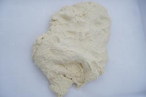

第二步，我们单独称好其他原料  

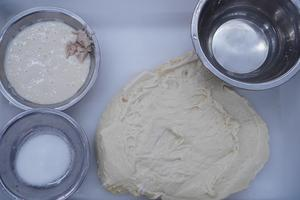

第三步，我们一次性加入我们的鲁邦种和鲜酵母进行搅拌 全程慢速搅拌 ，搅拌均匀后加入我们的盐和后加水    

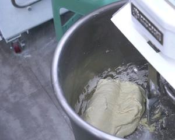

第四步，加入我们的盐 慢速度搅拌均匀即可  

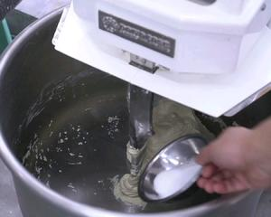

第五步，我们打面的最后一步，加入后加水进行搅拌均匀即可，在我们面筋基本上形成后就可以加入后加水搅拌了，搅拌到水吸收完成后面基本就打好了，后加水的目的在于刚开始面团吸水性太差，等面团打上劲度后再加入一些水 这个时候面团吸水性就增加了很多，也不会形成搅拌不起来的状态，所以加入后加水的时间大家一定要控制好，筋度达到了，就可以加了。通俗一点就是面团光滑了就可以加入了  

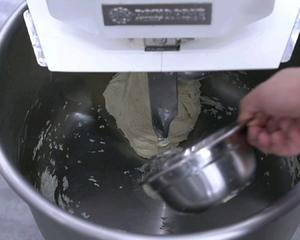

第六步，我们最后需要的面筋在九分样子 大概就是出膜，然后戳破后断口不是很光滑就可以了 一定要上筋，这样最后爆发力才好，膨胀里才好，气孔，耳朵，块头大就是靠面筋，很多人做出来不好看，体积偏小，开口爆裂的不高基本都是这个问题，面筋没打够，那种免揉的法棍耗时间太长，而且面团发酵时间长，产生得醋酸过多，口感就不好了 

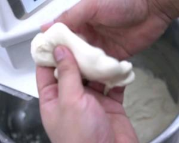

第七步，面团出来后第一位时间测温度，夏天最佳温度在21-22之间 这样室温高一些都没什么太大问题，然后我们进行第一次基础发酵40MIN样子。室温控制在28℃下 25度上，其实高一度低一度也没啥问题，该严谨的地方我们一定不马虎，这个轻微的温度改变对面包影响不是很大 

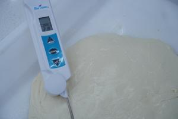

第八步，到了我们比较重要的一步，中间折叠，我们专业叫中间包气，就是通过折叠让面团包入更多气体，折叠还有一个目的就是使面筋更强劲，为后面的成型做准备，让烘烤出来的法棍更挺。两个三折 记着包入空气，折叠完后再继续基础发酵40分钟，即可分团预整形

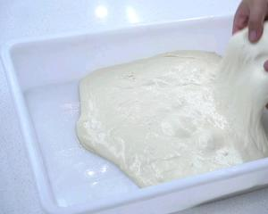

一定要定时

第九步，分团340克或者根据你需要的重量来分团就行，340做出来是一根55CM长的法棍

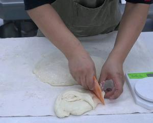

第十步，我们的预整形就是裹成一个纺锤形状，类似吐司一样，裹好后在冷藏松弛30分钟，松弛目的在于放松面筋，在最后成型时候更好的拉伸

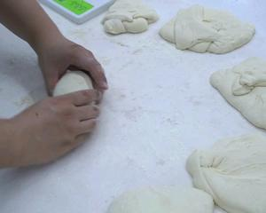

第十一步，放入盒子中冷藏松弛，冷藏是为了不要让面团在高温下继续产气，只是松弛面筋而已 

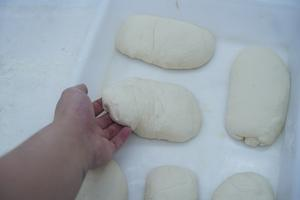

第十二步，松弛好的面团变得比较扁，中间没硬心，很软 

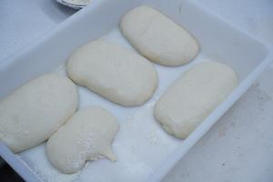

第十三步，成型我们轻微排气后进行一个收面团的操作

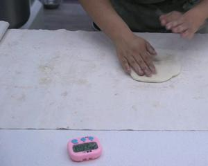
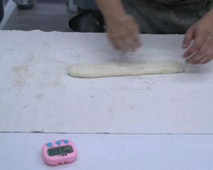

第十四步，发酵布进行最后发酵  

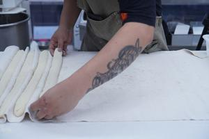

第十五步，最后发酵室温50分钟即可烘烤，我们放在帆布上发酵，避免过度的湿度给面团造成过多的水汽来影面团状态和操作难度，因为面团本身含水量已经比较高了  

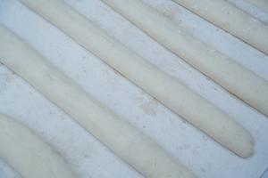

第十六步，用转移板把面团转移到油纸上，没有可以用菜板代替。 

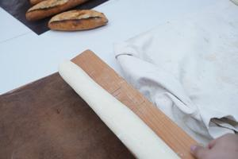

第十七步，割口，刮胡刀片即可，方法如视频 这个需要多练琴，发酵程度好的面团是不会粘刀片的

第十八步，割好后放入烤箱250度/230℃喷蒸汽烘烤18分钟，蒸汽很重要 足量的蒸汽让面包表面不快速结皮，有更大的空间用来膨胀。

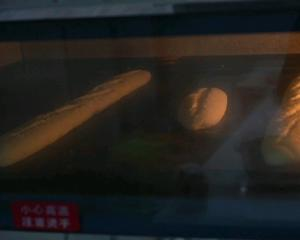

第十九步，拿出凉冷即可，冷后切割看气孔。

## 好吃的法棍三点

### 均匀气孔带来的膨胀感
### 皮薄的法棍带来的顺口感
### 面粉的使用带来的麦香味
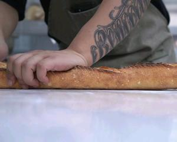

漂亮的耳朵  

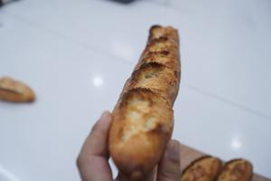
颜色糖化都很好
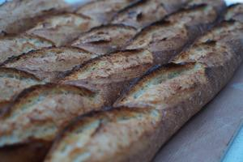
小气孔
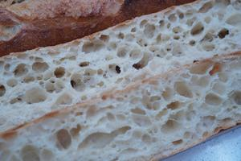

## 【视频教程】零基础手作家庭短法棍：最简单的方式，最普通的材料，常规发酵，在家制作法棍的过程和要点
<iframe src="//player.bilibili.com/player.html?isOutside=true&aid=590523931&bvid=BV1Eq4y1f7C1&cid=410163539&p=1" scrolling="no" border="0" frameborder="no" framespacing="0" allowfullscreen="true" width="800px" height="600px"></iframe>

## 免揉50%斯佩尔特小麦法棍视频制作教程
<iframe src="//player.bilibili.com/player.html?isOutside=true&aid=626894225&bvid=BV1jt4y1S7Qz&cid=232243942&p=1" scrolling="no" border="0" frameborder="no" framespacing="0" allowfullscreen="true" width="800px" height="600px"></iframe>