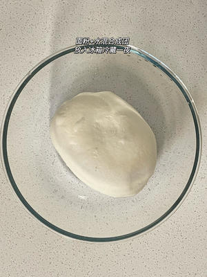
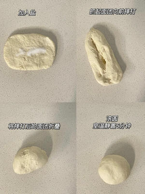
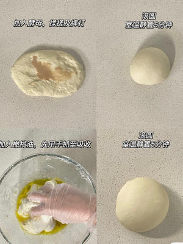
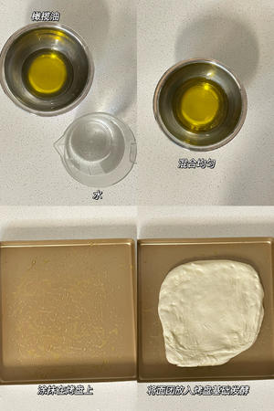
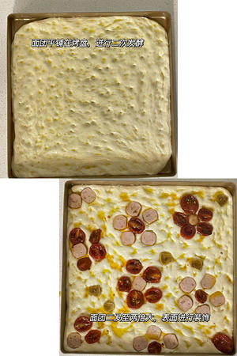
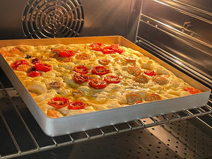
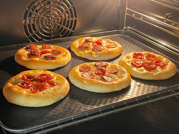

## 用料
主面团	

高筋面粉	350克

水	260克

盐	7克

鲜酵母	3克

橄榄油	25克

配料	

橄榄油	25克

水	25克

表面装饰	

油浸小番茄	适量

迷迭香	适量

任意食材	

## 制作教程
1⃣️将面粉与水混合搅拌均匀成团，放入冰箱冷藏一夜 

2⃣️取出面团摊开加入盐，像搓衣服一样揉搓面团大致均匀后抓起面团从高处往下向前进行摔打，将摔打折叠折叠，再次进行摔打、折叠反复操作持续5分钟后，将面团滚圆室温静置5分钟 

3⃣️面团摊开加入酵母，继续揉搓、摔打5分钟，再次滚圆室温静置5分钟

4⃣️面团放入盆中加入橄榄油，先抓至橄榄油吸收，继续揉搓、摔打5分钟，将面团滚圆

5⃣️将配料中的橄榄油与水混合均匀，涂抹在烤盘上，面团放入烤盘28度基础发酵60分钟 

6⃣️将发酵好的面团平铺在烤盘上，并用手沾湿配料中的橄榄油水后在面团上按压洞洞，35度最终发酵60分钟左右（至两倍大即可）
7⃣️发酵好的面团用自己喜欢的食材摆出任意造型装饰即可 

8⃣️烤箱提前预热至200度，烘烤20分钟左右（时间温度根据自家烤箱温度调整） 
也可以分割成小面团，做成小的佛卡夏

## 视频教程
### 意大利厨师长教你制作佛卡夏面包，经典意式扁平面包！
<iframe src="//player.bilibili.com/player.html?isOutside=true&aid=974749324&bvid=BV1944y1C7sT&cid=383772232&p=1" scrolling="no" border="0" frameborder="no" framespacing="0" allowfullscreen="true" width="800px" height="600px"></iframe>